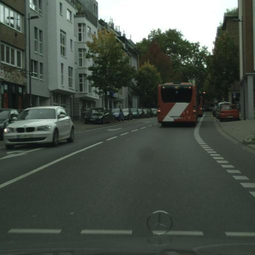
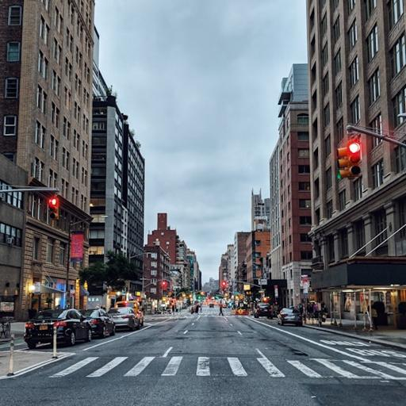

<!-- conda create -n DB_demo python=3.9
conda activate DB_demo
sudo apt update ; sudo apt install -y python3-opencv
pip install torch==2.1.1 torchvision==0.16.1 xformers==0.0.23

git clone https://github.com/huggingface/diffusers
cd DreamBooth/diffusers
pip install .
cd examples/dreambooth
pip install -r requirements.txt

pip install git+https://github.com/huggingface/peft.git@main
pip install numpy==1.26.4 -->

# 🎨 DreamBooth for fine-tune training on Diffusion Model

This project aims to leverage DreamBooth's fine-tuning capabilities to generate customized images within specific style domains for city scene (e.g., Cityscapes, BDD100K) based on a limited set of training data.

---

### 🛠️ Setup Environment (Priority Task)

❗The following version of torch, torchvision and xformers are compatible with the TWCC container image pytorch-23.08

```
conda create -n DreamBooth python=3.9
conda activate DreamBooth

sudo apt update ; sudo apt install -y python3-opencv
pip install torch==2.1.1 torchvision==0.16.1 xformers==0.0.23
```
---

### 📦 Install Dependencies

Please clone the [Diffusers](https://github.com/huggingface/diffusers) repository from Hugging Face and install the required packages:

⚠️ Diffusers was updated last week

```
git clone https://github.com/huggingface/diffusers

cd diffusers
pip install .

cd examples/dreambooth
pip install -r requirements.txt

pip install git+https://github.com/huggingface/peft.git@main
pip install numpy==1.26.4
```
---

### 📋 Prepare data before training

resize both instance images and class images to 512×512.  
❗ Please remember to modify the image path inside the rescale_image.py

* Instance Image: Images of the specific subject you want the model to learn and personalize
* Class Image: Generic images from the same category as the instance

🖼️ Example:
<table>
  <tr>
    <td align="center">
      <br/>
      <b>Instance Image (Cityscapes)</b>
    </td>
    <td align="center">
      <br/>
      <b>Class Image</b>
    </td>
  </tr>
</table>

```
python rescale_image.py
```

---

### 🧠 Training

❗Please remember to modify the relevant parameter inside the train.py script

```
python train.py
```
---

### 🔍 Inference

Load trained model and generate fine-tune images. You can use any prompt, but it must include the unique identifier

```
python inference.py
```
